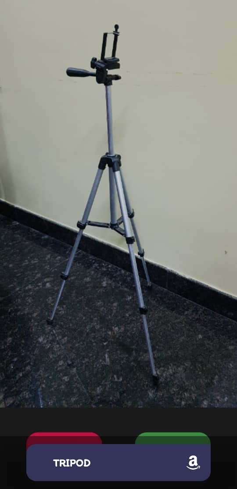

# Image-based Product Recommender
CS300 - mini project. A mobile application developed using flutter and dart that takes in an image and produces the text based classification of it and searches for it in amazon.

The image classifier model makes its prediction for the product class using a pre-trained ML model available at: “[https://www.tensorflow.org/lite/guide/hosted_models](https://www.tensorflow.org/lite/guide/hosted_models)”. We use the floating point Mobilenet_V2_1.0_224 model from the above link which has been trained over the ImageNet dataset and reports a Top-1 accuracy of 71.8% and a Top-5 accuracy of 90.6% over the same dataset. It is both lightweight taking up only 13.3 MB of space and runs quickly on-device with a good classification accuracy which suits our application use case.

Screenshots showcasing some working examples of product class recommendations made by our application are shown below:

More details along with the Final Report and the Implementation Report for this project can be found in the Docs folder.
